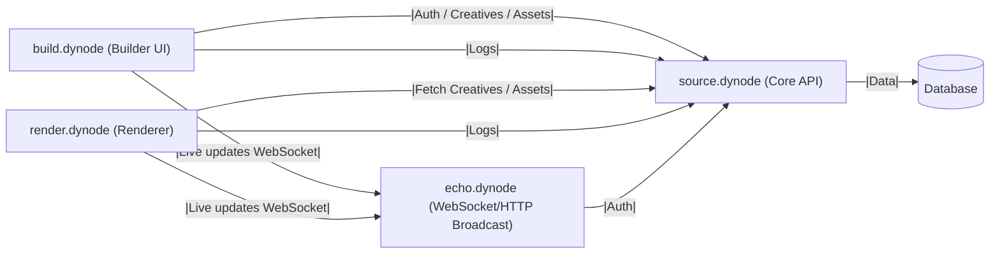

# Dynode Solution — High-Level Architecture Diagram

---

**Legend:**

- **build.dynode (Builder UI):**

  - Web-based interface for creative managers and operators
  - Handles authentication, creative listing, editing, and asset uploads
  - Communicates with source.dynode for all data and asset operations

- **render.dynode (Renderer):**

  - Renders dynamic creatives for preview and digital signage players
  - Fetches creative definitions and assets from source.dynode
  - Provides production-ready bundles and previews

- **source.dynode (Core API):**

  - Central backend service and system of record
  - Manages authentication, creatives, assets, and user data
  - Exposes APIs for build.dynode and render.dynode
  - Stores all persistent data in the database

- **echo.dynode (WebSocket/HTTP Broadcast):**

  - Real-time communication server for live updates and notifications
  - Supports WebSocket and HTTP broadcast to clients
  - Used for pushing updates to UIs and players

- **Database:**
  - Persistent storage for all creatives, assets, users, and logs
  - Accessed only by source.dynode

_This diagram is suitable for upper management and omits technical details._
