# Dynode Solution Architecture

> **Version:** 3.0  
> **Date:** February 6, 2026  
> **Purpose:** Comprehensive architecture reference for the DN Dynamic Campaign Tools ecosystem

## Table of Contents

1. [System Overview](#system-overview)
2. [Service Architecture](#service-architecture)
3. [Data Flow Patterns](#data-flow-patterns)
4. [Integration Patterns](#integration-patterns)
5. [Deployment Architecture](#deployment-architecture)
6. [Security Architecture](#security-architecture)

---

## 1. System Overview

### 1.1 Introduction

**Dynode** (DN Dynamic Campaign Tools) is a microservices-based platform for creating, managing, and delivering dynamic digital advertising campaigns. The system consists of four specialized services that work together to provide a complete creative management and delivery solution.

### 1.2 High-Level Architecture

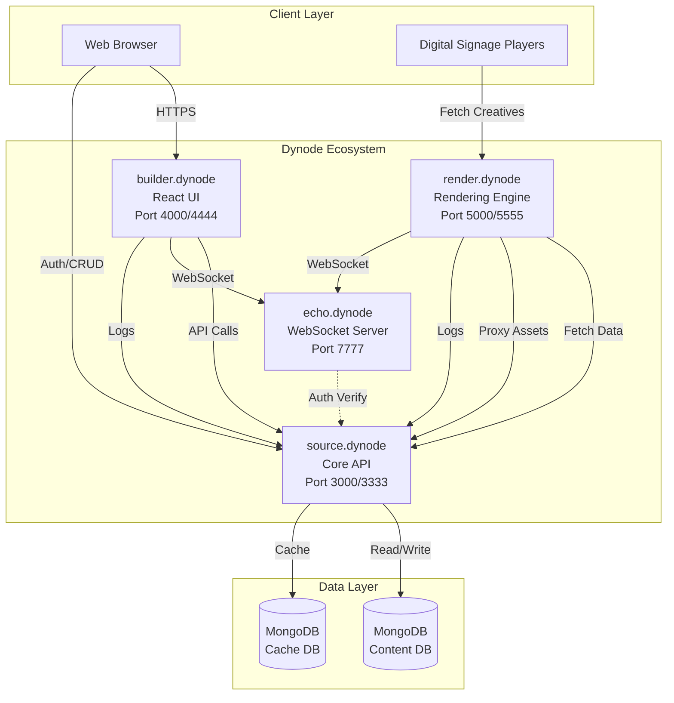
```mermaid
flowchart TB
    subgraph "Client Layer"
        BROWSER[Web Browser]
        PLAYER[Digital Signage Players]
    end

    subgraph "Dynode Ecosystem"
        BUILDER[builder.dynode<br/>React UI<br/>Port 4000/4444]
        RENDER[render.dynode<br/>Rendering Engine<br/>Port 5000/5555]
        SOURCE[source.dynode<br/>Core API<br/>Port 3000/3333]
        ECHO[echo.dynode<br/>WebSocket Server<br/>Port 7777]
    end

    subgraph "Data Layer"
        MONGODB[(MongoDB<br/>Content DB)]
        CACHE[(MongoDB<br/>Cache DB)]
    end

    BROWSER -->|HTTPS| BUILDER
    BROWSER -->|Auth/CRUD| SOURCE
    PLAYER -->|Fetch Creatives| RENDER

    BUILDER -->|API Calls| SOURCE
    BUILDER -->|WebSocket| ECHO
    BUILDER -->|Logs| SOURCE

    RENDER -->|Fetch Data| SOURCE
    RENDER -->|Proxy Assets| SOURCE
    RENDER -->|Logs| SOURCE
    RENDER -->|WebSocket| ECHO

    SOURCE -->|Read/Write| MONGODB
    SOURCE -->|Cache| CACHE

    ECHO -.->|Auth Verify| SOURCE
```

### 1.3 Service Responsibilities

| Service            | Primary Role                | Technology Stack                 | Key Features                                    |
| ------------------ | --------------------------- | -------------------------------- | ----------------------------------------------- |
| **source.dynode**  | Core API & System of Record | Express 5.1, TypeScript, MongoDB | Authentication, CRUD, Asset Storage, Logging    |
| **echo.dynode**    | Real-time Communication     | ws 8.18, Pure Node.js            | WebSocket Broadcasting, Room Management         |
| **builder.dynode** | Management Interface        | React 19, Vite 6.3, Ant Design   | Creative Editing, Asset Upload, User Management |
| **render.dynode**  | Creative Delivery           | Express 5.1, Terser, CleanCSS    | On-demand Bundling, Template Rendering          |

---

## 2. Service Architecture

### 2.1 Source.dynode (Core API Service)

#### 2.1.1 Application Structure

```mermaid
flowchart LR
    subgraph "Entry Point"
        APP[app.ts]
        CONFIG[config.ts]
    end

    subgraph "Middleware"
        CORS[CORS Handler]
        AUTH[JWT Auth]
        MORGAN[Request Logger]
    end

    subgraph "Routes"
        R_AUTH[/auth]
        R_LOGIN[/login]
        R_DATA[/data]
        R_FILES[/files]
        R_DOCS[/docs]
    end

    subgraph "Services"
        LOGGER[logger.ts]
        REGISTER[register.ts<br/>Multer Storage]
        SCRAPPER[scrapper.ts<br/>Resource Extraction]
    end

    subgraph "Models"
        COLLECTIONS[Collections<br/>Raw Documents]
        VIEWS[Materialized Views<br/>Denormalized Data]
    end

    APP --> CONFIG
    APP --> CORS
    APP --> AUTH
    APP --> MORGAN
    APP --> R_AUTH
    APP --> R_LOGIN
    APP --> R_DATA
    APP --> R_FILES
    APP --> R_DOCS

    R_DATA --> COLLECTIONS
    R_DATA --> VIEWS
    R_DATA --> SCRAPPER
    R_FILES --> REGISTER
    R_FILES --> LOGGER
```

#### 2.1.2 Dual MongoDB Architecture

Source.dynode uses **two separate MongoDB connections**:

1. **Content Database** (`dyna_content`)
   - Primary data store for all business entities
   - Collections: Users, Assets, Components, Elements, Creatives (Assembly/Dynamic/Interactive), Sources
   - Materialized views for performance optimization

2. **Cache Database** (`dyna_sources`)
   - Temporary buffer storage
   - Collection: BufferCollection
   - Used for transient data and caching

**Connection Pattern:**

```typescript
// Primary connection (default mongoose)
await mongoose.connect(config.mongoUri);

// Secondary connection (cache)
cacheConnection = mongoose.createConnection(config.cacheMongoUri);
BufferCollection = cacheConnection.model("BufferCollection", schema);
```

#### 2.1.3 Authentication System

**Two Authentication Methods:**

**Method 1: Email + Verification Code**

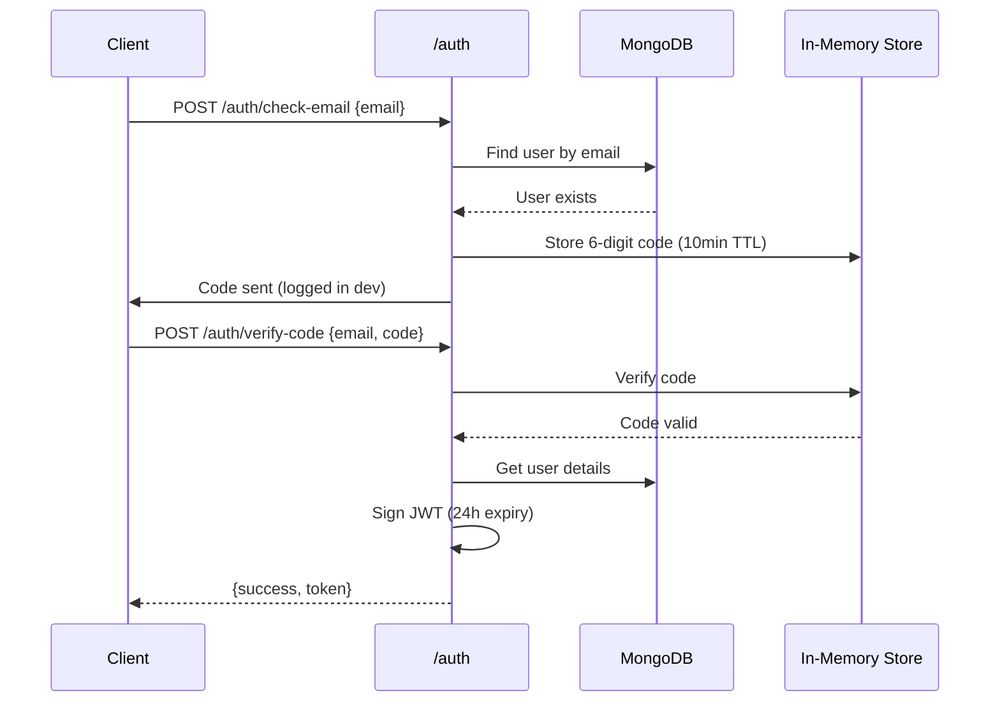
```mermaid
sequenceDiagram
    participant Client
    participant API as /auth
    participant DB as MongoDB
    participant Memory as In-Memory Store

    Client->>API: POST /auth/check-email {email}
    API->>DB: Find user by email
    DB-->>API: User exists
    API->>Memory: Store 6-digit code (10min TTL)
    API->>Client: Code sent (logged in dev)

    Client->>API: POST /auth/verify-code {email, code}
    API->>Memory: Verify code
    Memory-->>API: Code valid
    API->>DB: Get user details
    API->>API: Sign JWT (24h expiry)
    API-->>Client: {success, token}
```

**Method 2: Password-based Login**

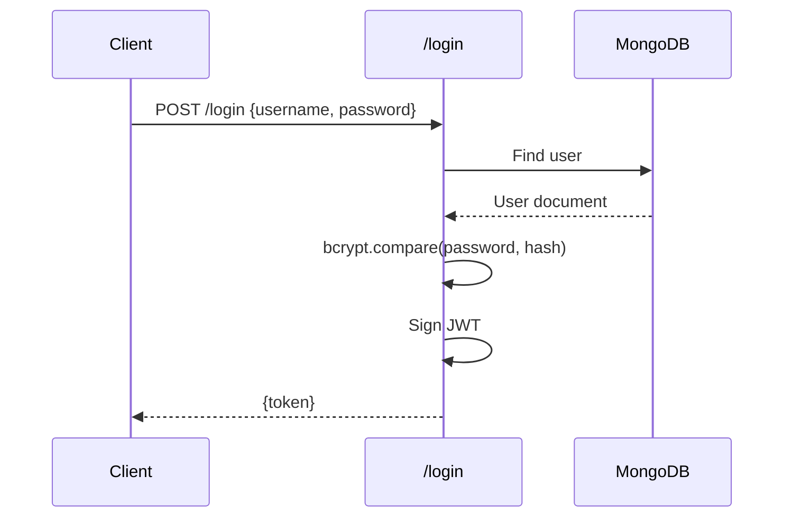
```mermaid
sequenceDiagram
    participant Client
    participant API as /login
    participant DB as MongoDB

    Client->>API: POST /login {username, password}
    API->>DB: Find user
    DB-->>API: User document
    API->>API: bcrypt.compare(password, hash)
    API->>API: Sign JWT
    API-->>Client: {token}
```

#### 2.1.4 Resource Scraping Pipeline

The scrapper service automatically extracts component, library, and asset references from creative JSON:

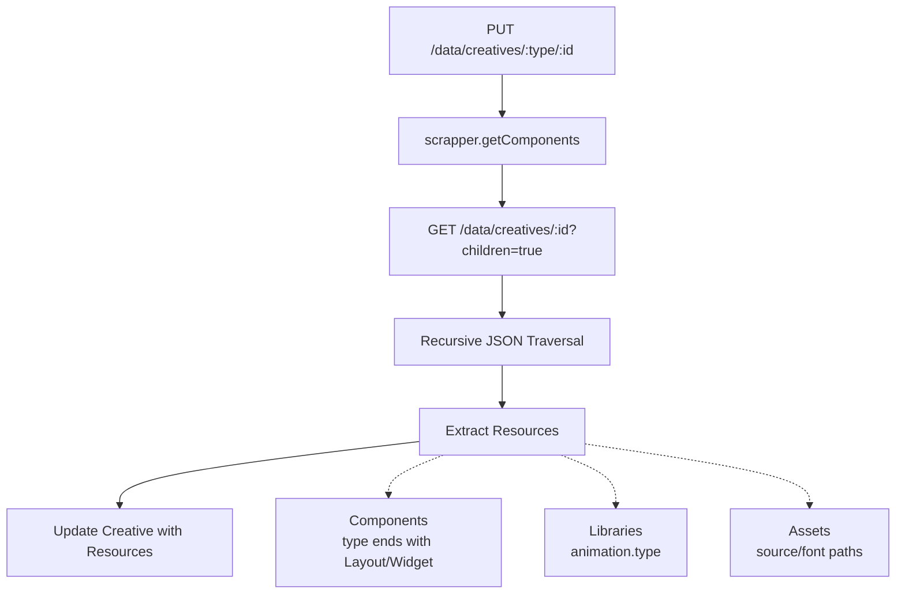
```mermaid
flowchart TD
    START[PUT /data/creatives/:type/:id]
    SCRAPE[scrapper.getComponents]
    FETCH[GET /data/creatives/:id?children=true]
    RECURSE[Recursive JSON Traversal]
    EXTRACT[Extract Resources]
    UPSERT[Update Creative with Resources]

    START --> SCRAPE
    SCRAPE --> FETCH
    FETCH --> RECURSE
    RECURSE --> EXTRACT
    EXTRACT --> UPSERT

    EXTRACT -.-> COMP[Components<br/>type ends with Layout/Widget]
    EXTRACT -.-> LIB[Libraries<br/>animation.type]
    EXTRACT -.-> ASSETS[Assets<br/>source/font paths]
```

**Extracted Resource Structure:**

```json
{
  "components": ["ImageLayout", "TextWidget"],
  "libraries": ["ImageLayout/fadeAnimation"],
  "assets": {
    "image-64abc123": {
      "name": "background.jpg",
      "paths": ["/dynamics/123/bg.opt.jpg"]
    }
  }
}
```

#### 2.1.5 Materialized Views Strategy

**Collections vs Views:**

- **Collections**: Raw documents with full write access
  - `creatives_assemblies`, `creatives_dynamics`, `creatives_interactives`
  - `elements_collection`, `assets_collection`, `components_collection`

- **Views**: Pre-computed aggregations for read performance
  - `creatives_unified_view` - All creative types flattened
  - `creatives_unified_view_elements` - Creatives with populated elements
  - `elements_assets_view` - Elements with asset metadata
  - `elements_binding_view` - Elements with data binding info

**Usage Pattern:**

```typescript
// Write to collection
await CreativeDynamicCollection.findByIdAndUpdate(id, data);

// Read from view (faster)
const creative = await CreativeDynamicView.findById(id);
```

### 2.2 Echo.dynode (WebSocket Broadcast Server)

#### 2.2.1 BaseRoomHandler Pattern

Echo.dynode uses an **inheritance-based room handler system**:

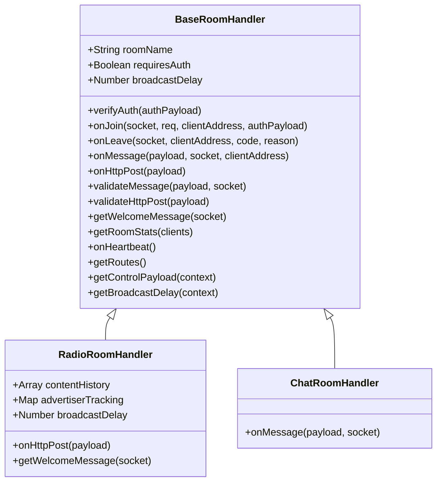
```mermaid
classDiagram
    class BaseRoomHandler {
        +String roomName
        +Boolean requiresAuth
        +Number broadcastDelay
        +verifyAuth(authPayload)
        +onJoin(socket, req, clientAddress, authPayload)
        +onLeave(socket, clientAddress, code, reason)
        +onMessage(payload, socket, clientAddress)
        +onHttpPost(payload)
        +validateMessage(payload, socket)
        +validateHttpPost(payload)
        +getWelcomeMessage(socket)
        +getRoomStats(clients)
        +onHeartbeat()
        +getRoutes()
        +getControlPayload(context)
        +getBroadcastDelay(context)
    }

    class RadioRoomHandler {
        +Array contentHistory
        +Map advertiserTracking
        +Number broadcastDelay
        +onHttpPost(payload)
        +getWelcomeMessage(socket)
    }

    class ChatRoomHandler {
        +onMessage(payload, socket)
    }

    BaseRoomHandler <|-- RadioRoomHandler
    BaseRoomHandler <|-- ChatRoomHandler
```

#### 2.2.2 Room Auto-Discovery

Rooms are automatically discovered and registered from the `src/rooms/` directory:

```
src/rooms/
├── BaseRoomHandler.js      # Abstract base class
├── index.js                 # Auto-discovery logic
├── routes.js                # Generic HTTP routes
├── radio/
│   └── RadioRoomHandler.js  # Extends BaseRoomHandler
└── chat/
    └── ChatRoomHandler.js   # Extends BaseRoomHandler
```

**Discovery Process:**

1. Scan `src/rooms/` for subdirectories
2. Import `{RoomName}RoomHandler.js` from each subdirectory
3. Instantiate handler and register with server
4. Mount HTTP routes for each room

#### 2.2.3 Authentication & Token Signing

**HMAC-SHA256 Token Generation:**

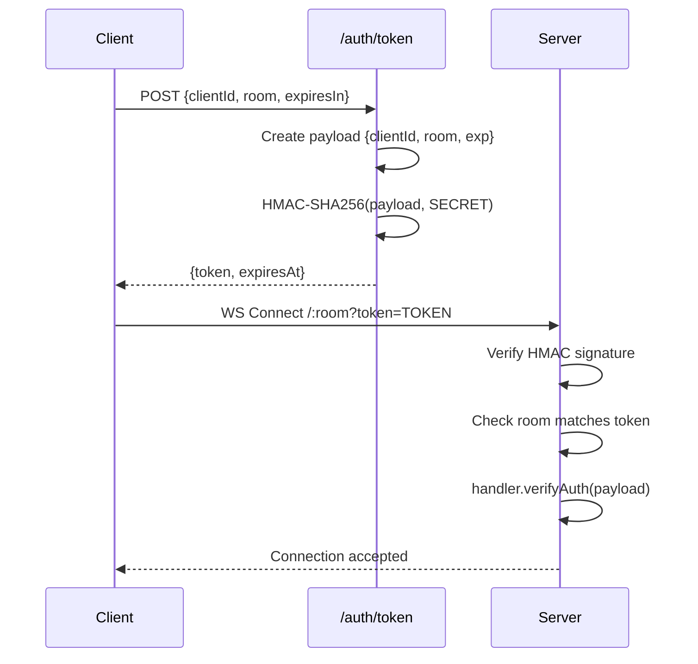
```mermaid
sequenceDiagram
    participant Client
    participant API as /auth/token
    participant Server

    Client->>API: POST {clientId, room, expiresIn}
    API->>API: Create payload {clientId, room, exp}
    API->>API: HMAC-SHA256(payload, SECRET)
    API-->>Client: {token, expiresAt}

    Client->>Server: WS Connect /:room?token=TOKEN
    Server->>Server: Verify HMAC signature
    Server->>Server: Check room matches token
    Server->>Server: handler.verifyAuth(payload)
    Server-->>Client: Connection accepted
```

**Token Payload:**

```json
{
  "clientId": "player-001",
  "room": "radio",
  "exp": 1707235200
}
```

#### 2.2.4 Broadcast Delay & Control Channels

**Broadcast Delay:**

- Configurable per room via `broadcastDelay` property
- Allows synchronized content delivery across multiple clients
- Implemented via `setTimeout` before broadcasting

**Control Channels:**

- Special WebSocket connections for management/monitoring
- Receive metadata about broadcasts without content
- Used for analytics and real-time dashboards

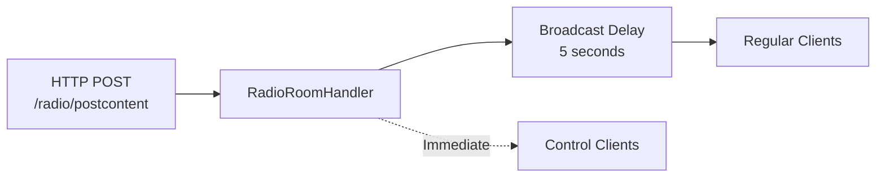
```mermaid
flowchart LR
    HTTP[HTTP POST<br/>/radio/postcontent]
    HANDLER[RadioRoomHandler]
    DELAY[Broadcast Delay<br/>5 seconds]
    CLIENTS[Regular Clients]
    CONTROL[Control Clients]

    HTTP --> HANDLER
    HANDLER --> DELAY
    DELAY --> CLIENTS
    HANDLER -.->|Immediate| CONTROL
```

#### 2.2.5 HTTP Injection Architecture

**Server-to-Client Push:**

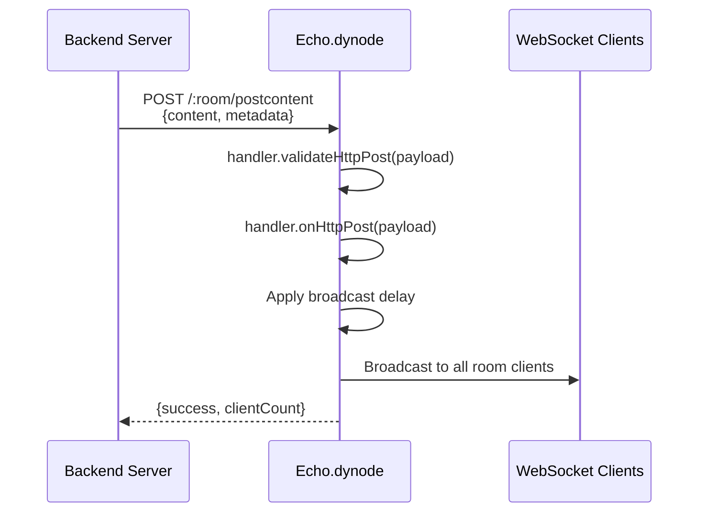
```mermaid
sequenceDiagram
    participant Server as Backend Server
    participant Echo as Echo.dynode
    participant Clients as WebSocket Clients

    Server->>Echo: POST /:room/postcontent<br/>{content, metadata}
    Echo->>Echo: handler.validateHttpPost(payload)
    Echo->>Echo: handler.onHttpPost(payload)
    Echo->>Echo: Apply broadcast delay
    Echo->>Clients: Broadcast to all room clients
    Echo-->>Server: {success, clientCount}
```

**Endpoint:** `POST /:room/postcontent`
**Headers:** `Authorization: Bearer TOKEN`
**Body:**

```json
{
  "type": "radio-content",
  "content": {...},
  "metadata": {...}
}
```

### 2.3 Builder.dynode (React Management Interface)

#### 2.3.1 Component Hierarchy & Lazy Loading

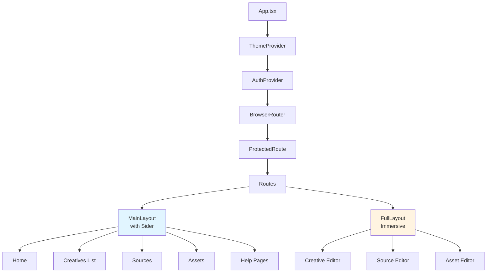
```mermaid
flowchart TD
    APP[App.tsx]
    THEME[ThemeProvider]
    AUTH[AuthProvider]
    ROUTER[BrowserRouter]
    PROTECTED[ProtectedRoute]
    ROUTES[Routes]

    APP --> THEME
    THEME --> AUTH
    AUTH --> ROUTER
    ROUTER --> PROTECTED
    PROTECTED --> ROUTES

    ROUTES --> MAIN[MainLayout<br/>with Sider]
    ROUTES --> FULL[FullLayout<br/>Immersive]

    MAIN --> HOME[Home]
    MAIN --> CREATIVES[Creatives List]
    MAIN --> SOURCES[Sources]
    MAIN --> ASSETS[Assets]
    MAIN --> HELP[Help Pages]

    FULL --> EDIT[Creative Editor]
    FULL --> SOURCE_EDIT[Source Editor]
    FULL --> ASSET_EDIT[Asset Editor]

    style MAIN fill:#e1f5ff
    style FULL fill:#fff4e1
```

**Lazy Loading Pattern:**

```typescript
const Edit = lazy(() => import('./pages/Creatives/Edit'));
const Assets = lazy(() => import('./pages/Assets/Default'));

<Suspense fallback={<Spin size="large" />}>
  <Routes>
    <Route path="creatives/edit/:id" element={<Edit />} />
  </Routes>
</Suspense>
```

#### 2.3.2 Routing Strategy

**Two Layout Types:**

1. **MainLayout** - Standard application layout
   - Top header with branding
   - Left sidebar navigation
   - Content area with breadcrumbs
   - Used for: Home, Creatives list, Assets, Help, etc.

2. **FullLayout** - Immersive full-screen layout
   - Minimal chrome, maximum workspace
   - Used for: Creative editor, Source editor, Asset editor

**Route Structure:**

```
/                           → MainLayout → Home
/creatives                  → MainLayout → Creatives List
/creatives/edit/:id         → FullLayout → Creative Editor
/sources                    → MainLayout → Sources List
/sources/:id                → FullLayout → Source Editor
/assets                     → MainLayout → Assets List
/assets/:id                 → FullLayout → Asset Editor
/help                       → MainLayout → Help Index
/help/components            → MainLayout → Component Docs
/help/design                → MainLayout → Design Guide
/help/codebase              → MainLayout → Codebase Docs
/community                  → MainLayout → Community
/templates                  → MainLayout → Templates
```

#### 2.3.3 Service Layer Architecture

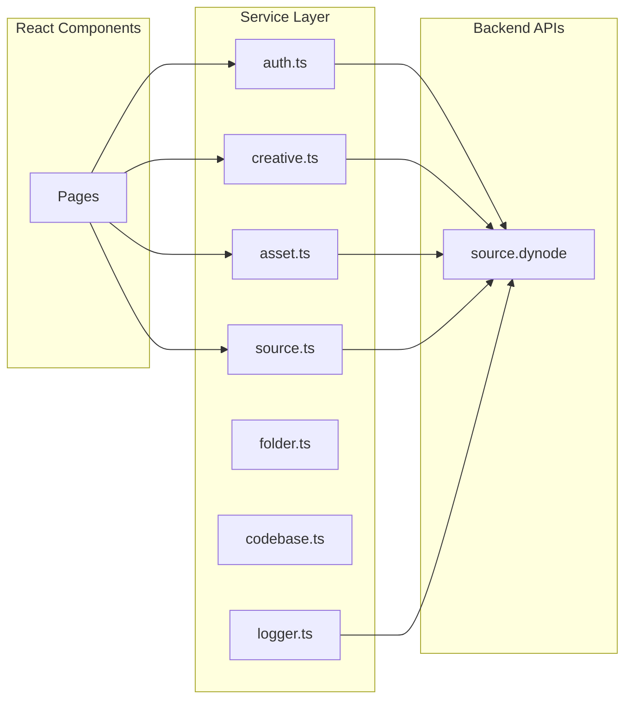
```mermaid
flowchart LR
    subgraph "React Components"
        PAGES[Pages]
    end

    subgraph "Service Layer"
        AUTH_SVC[auth.ts]
        CREATIVE_SVC[creative.ts]
        ASSET_SVC[asset.ts]
        SOURCE_SVC[source.ts]
        FOLDER_SVC[folder.ts]
        CODEBASE_SVC[codebase.ts]
        LOGGER_SVC[logger.ts]
    end

    subgraph "Backend APIs"
        SOURCE_API[source.dynode]
    end

    PAGES --> AUTH_SVC
    PAGES --> CREATIVE_SVC
    PAGES --> ASSET_SVC
    PAGES --> SOURCE_SVC

    AUTH_SVC --> SOURCE_API
    CREATIVE_SVC --> SOURCE_API
    ASSET_SVC --> SOURCE_API
    SOURCE_SVC --> SOURCE_API
    LOGGER_SVC --> SOURCE_API
```

**Service Responsibilities:**

- `auth.ts` - Email/code verification, token management
- `creative.ts` - CRUD operations for creatives, element flattening
- `asset.ts` - Asset upload, metadata management
- `source.ts` - Data source management
- `folder.ts` - Folder organization
- `codebase.ts` - Component library management
- `logger.ts` - Client-side error forwarding to source.dynode

#### 2.3.4 State Management

**State Management Stack:**

1. **Zustand** - Global state management
   - Lightweight alternative to Redux
   - Used for application-wide state

2. **AuthContext** - Authentication state
   - Token persistence (localStorage)
   - User profile
   - Domain access

3. **ThemeContext** - Theme management
   - Light/dark mode toggle
   - Persisted preferences

**AuthContext Flow:**

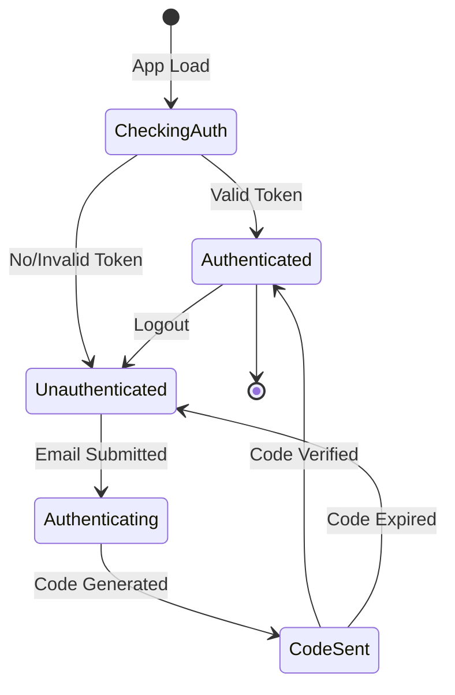
```mermaid
stateDiagram-v2
    [*] --> CheckingAuth: App Load
    CheckingAuth --> Authenticated: Valid Token
    CheckingAuth --> Unauthenticated: No/Invalid Token

    Unauthenticated --> Authenticating: Email Submitted
    Authenticating --> CodeSent: Code Generated
    CodeSent --> Authenticated: Code Verified
    CodeSent --> Unauthenticated: Code Expired

    Authenticated --> Unauthenticated: Logout
    Authenticated --> [*]
```

### 2.4 Render.dynode (Creative Rendering Engine)

#### 2.4.1 Rendering Pipeline Flow

```mermaid
flowchart TD
    REQUEST[GET /dynamics/:id]
    FETCH[Fetch Creative from source.dynode]
    BEHAVIOR[Apply Behaviors]
    TEMPLATE[Render Pug Template]
    RESPONSE[HTML Response]

    REQUEST --> FETCH
    FETCH --> BEHAVIOR
    BEHAVIOR --> TEMPLATE
    TEMPLATE --> RESPONSE

    RESPONSE -.->|References| COMP[/dynamics/:id/components.min.js]
    RESPONSE -.->|References| LIB[/dynamics/:id/libraries.min.js]
    RESPONSE -.->|References| CSS[/dynamics/:id/assets.min.css]
    RESPONSE -.->|References| MGR[/dynamics/:id/manager.min.js]

    COMP --> BUNDLE[Bundler Service]
    LIB --> BUNDLE
    CSS --> BUNDLE
    MGR --> BUNDLE

    BUNDLE --> MINIFY[Terser/CleanCSS]
    MINIFY --> CACHED[LRU Cache]
    CACHED --> CLIENT[Client Browser]
```

#### 2.4.2 Bundler Architecture

**Bundler Service** (`services/bundler.ts`):

```typescript
interface BundleRequest {
  creativeId: string;
  name: "components" | "libraries" | "assets" | "manager";
  items: string[];
  mode: boolean; // true = minified
  extension: "js" | "css";
}

interface BundleResponse {
  payload: string;
  contentType: string;
}
```

**Bundling Process:**

1. **Component Bundling** (`components.min.js`)
   - Read component files from `views/scripts/components/`
   - Concatenate in dependency order
   - Minify with Terser

2. **Library Bundling** (`libraries.min.js`)
   - Read animation libraries
   - Concatenate
   - Minify with Terser

3. **Asset CSS Bundling** (`assets.min.css`)
   - Generate `@font-face` rules from asset metadata
   - Combine with custom styles
   - Minify with CleanCSS

4. **Manager Bundling** (`manager.min.js`)
   - Read manager template
   - Inject creative-specific configuration
   - Minify with Terser

#### 2.4.3 Behavior Application System

**Behaviors** modify creative data before rendering:

```typescript
// services/behaviours.ts
function applyBehavioursToCreative(creative: any): any {
  // Apply transformations to creative data
  // Examples:
  // - Resolve data bindings
  // - Apply conditional logic
  // - Transform element properties
  // - Inject runtime configuration
  return transformedCreative;
}
```

**Use Cases:**

- Dynamic data injection
- Conditional element visibility
- Runtime property calculation
- Environment-specific configuration

#### 2.4.4 Asset Proxying Mechanism

**Asset Proxy Flow:**

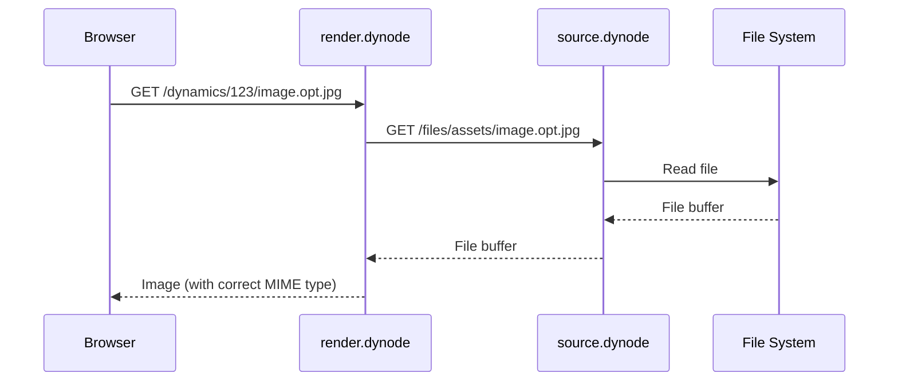
```mermaid
sequenceDiagram
    participant Browser
    participant Render as render.dynode
    participant Source as source.dynode
    participant Storage as File System

    Browser->>Render: GET /dynamics/123/image.opt.jpg
    Render->>Source: GET /files/assets/image.opt.jpg
    Source->>Storage: Read file
    Storage-->>Source: File buffer
    Source-->>Render: File buffer
    Render-->>Browser: Image (with correct MIME type)
```

**Supported MIME Types:**

- Images: jpg, jpeg, png, svg, gif, bmp, webp
- Videos: mov, mp4, avi, webm, mkv
- Fonts: ttf, otf, woff, woff2, eot

---

## 3. Data Flow Patterns

### 3.1 Authentication Flow

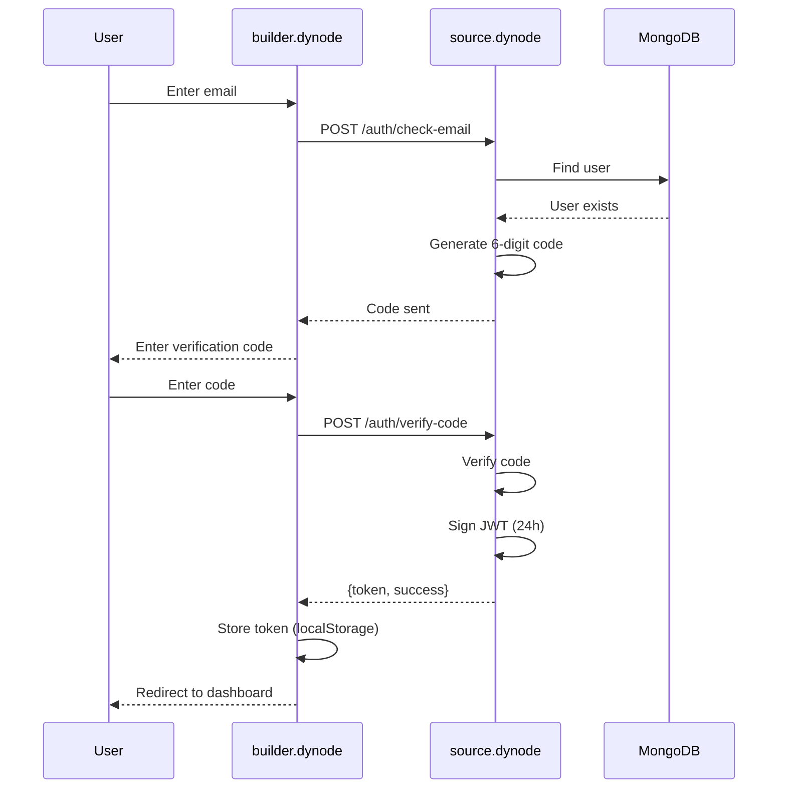
```mermaid
sequenceDiagram
    participant User
    participant Builder as builder.dynode
    participant Source as source.dynode
    participant DB as MongoDB

    User->>Builder: Enter email
    Builder->>Source: POST /auth/check-email
    Source->>DB: Find user
    DB-->>Source: User exists
    Source->>Source: Generate 6-digit code
    Source-->>Builder: Code sent
    Builder-->>User: Enter verification code

    User->>Builder: Enter code
    Builder->>Source: POST /auth/verify-code
    Source->>Source: Verify code
    Source->>Source: Sign JWT (24h)
    Source-->>Builder: {token, success}
    Builder->>Builder: Store token (localStorage)
    Builder-->>User: Redirect to dashboard
```

### 3.2 Creative CRUD Flow

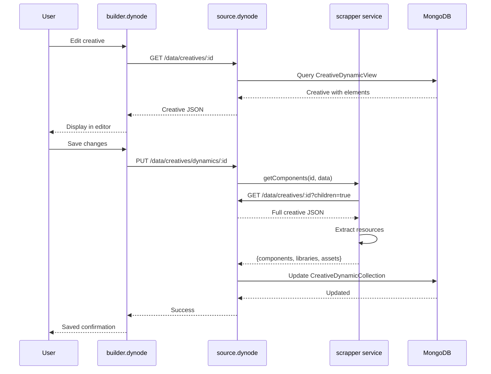
```mermaid
sequenceDiagram
    participant User
    participant Builder as builder.dynode
    participant Source as source.dynode
    participant Scrapper as scrapper service
    participant DB as MongoDB

    User->>Builder: Edit creative
    Builder->>Source: GET /data/creatives/:id
    Source->>DB: Query CreativeDynamicView
    DB-->>Source: Creative with elements
    Source-->>Builder: Creative JSON
    Builder-->>User: Display in editor

    User->>Builder: Save changes
    Builder->>Source: PUT /data/creatives/dynamics/:id
    Source->>Scrapper: getComponents(id, data)
    Scrapper->>Source: GET /data/creatives/:id?children=true
    Source-->>Scrapper: Full creative JSON
    Scrapper->>Scrapper: Extract resources
    Scrapper-->>Source: {components, libraries, assets}
    Source->>DB: Update CreativeDynamicCollection
    DB-->>Source: Updated
    Source-->>Builder: Success
    Builder-->>User: Saved confirmation
```

### 3.3 Asset Upload and Delivery

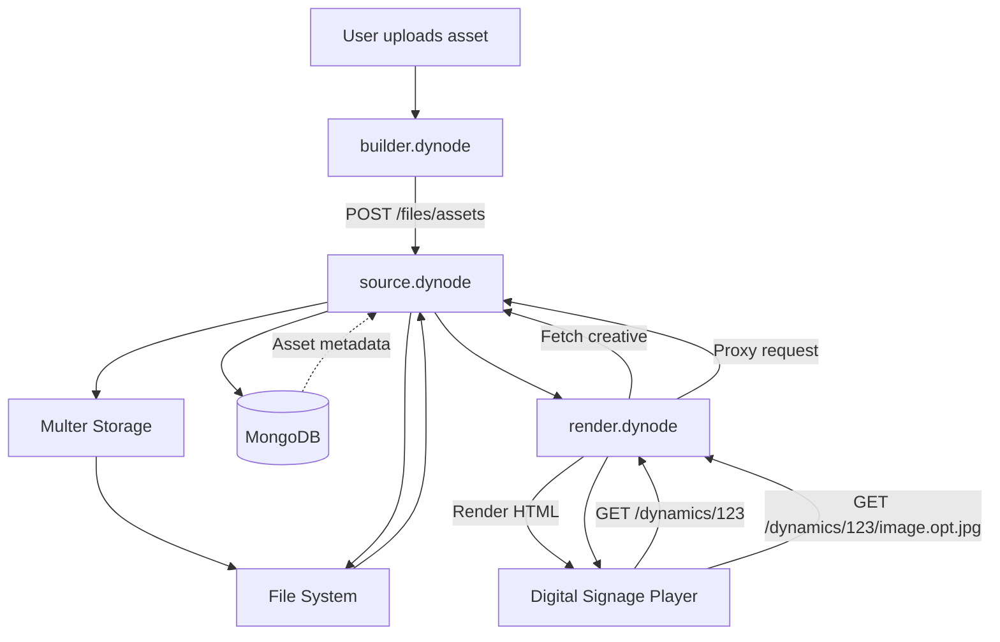
```mermaid
flowchart TD
    UPLOAD[User uploads asset]
    BUILDER[builder.dynode]
    SOURCE[source.dynode]
    MULTER[Multer Storage]
    FS[File System]
    DB[(MongoDB)]
    RENDER[render.dynode]
    PLAYER[Digital Signage Player]

    UPLOAD --> BUILDER
    BUILDER -->|POST /files/assets| SOURCE
    SOURCE --> MULTER
    MULTER --> FS
    SOURCE --> DB
    DB -.->|Asset metadata| SOURCE

    PLAYER -->|GET /dynamics/123| RENDER
    RENDER -->|Fetch creative| SOURCE
    RENDER -->|Render HTML| PLAYER
    PLAYER -->|GET /dynamics/123/image.opt.jpg| RENDER
    RENDER -->|Proxy request| SOURCE
    SOURCE --> FS
    FS --> SOURCE
    SOURCE --> RENDER
    RENDER --> PLAYER
```

### 3.4 Real-time Updates

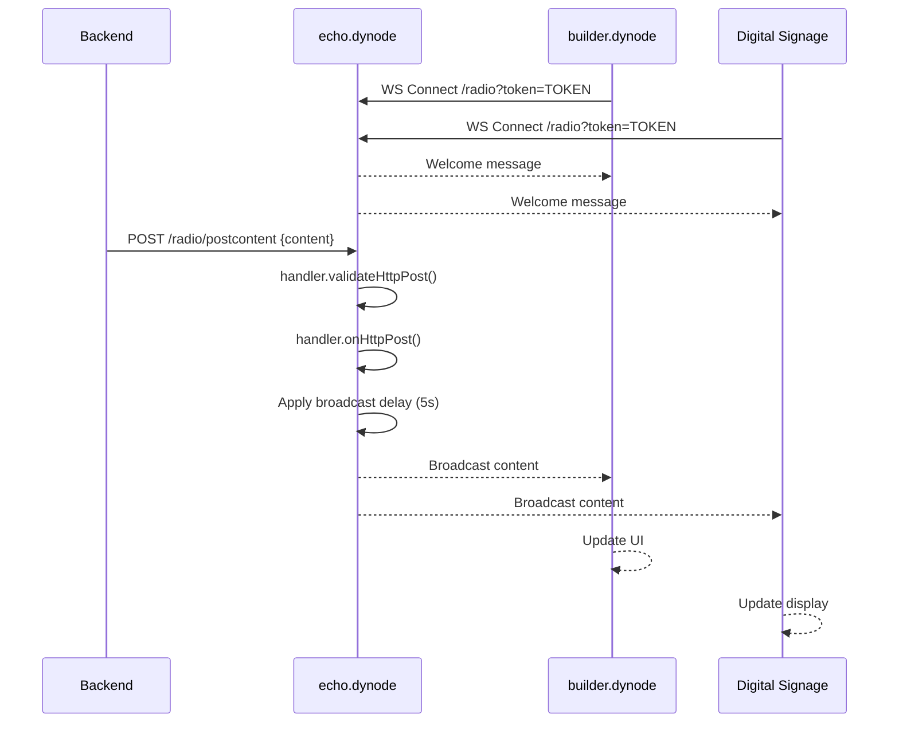
```mermaid
sequenceDiagram
    participant Backend
    participant Echo as echo.dynode
    participant Builder as builder.dynode
    participant Player as Digital Signage

    Builder->>Echo: WS Connect /radio?token=TOKEN
    Player->>Echo: WS Connect /radio?token=TOKEN
    Echo-->>Builder: Welcome message
    Echo-->>Player: Welcome message

    Backend->>Echo: POST /radio/postcontent {content}
    Echo->>Echo: handler.validateHttpPost()
    Echo->>Echo: handler.onHttpPost()
    Echo->>Echo: Apply broadcast delay (5s)
    Echo-->>Builder: Broadcast content
    Echo-->>Player: Broadcast content

    Builder-->>Builder: Update UI
    Player-->>Player: Update display
```

### 3.5 Logging Aggregation

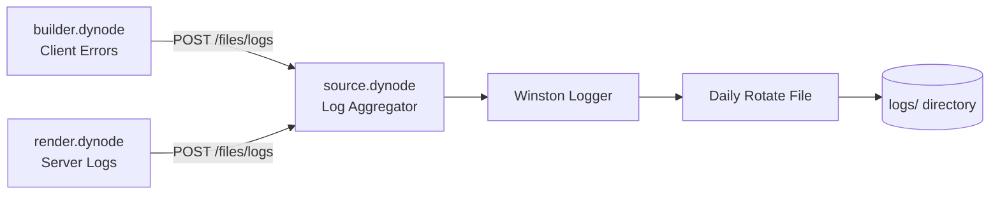
```mermaid
flowchart LR
    BUILDER[builder.dynode<br/>Client Errors]
    RENDER[render.dynode<br/>Server Logs]
    SOURCE[source.dynode<br/>Log Aggregator]
    WINSTON[Winston Logger]
    ROTATE[Daily Rotate File]
    LOGS[(logs/ directory)]

    BUILDER -->|POST /files/logs| SOURCE
    RENDER -->|POST /files/logs| SOURCE
    SOURCE --> WINSTON
    WINSTON --> ROTATE
    ROTATE --> LOGS
```

---

## 4. Integration Patterns

### 4.1 Service-to-Service Communication

**Communication Matrix:**

| From → To        | Protocol   | Purpose                       | Example                   |
| ---------------- | ---------- | ----------------------------- | ------------------------- |
| builder → source | HTTPS/REST | Auth, CRUD, Assets            | `POST /auth/verify-code`  |
| builder → echo   | WebSocket  | Live updates                  | `WS /radio?token=TOKEN`   |
| render → source  | HTTP/REST  | Fetch creatives, proxy assets | `GET /data/creatives/:id` |
| render → echo    | WebSocket  | Live updates                  | `WS /radio?token=TOKEN`   |
| backend → echo   | HTTP POST  | Trigger broadcasts            | `POST /radio/postcontent` |
| builder → source | HTTP POST  | Forward logs                  | `POST /files/logs`        |
| render → source  | HTTP POST  | Forward logs                  | `POST /files/logs`        |

### 4.2 Internal vs External Origins

**Configuration Pattern:**

```typescript
interface Config {
  env: "development" | "production" | "staging" | "test" | "docker";

  // External origins (browser-facing URLs)
  externalOrigins: {
    source: "http://localhost:3333";
    render: "http://localhost:5555";
    builder: "http://localhost:4444";
  };

  // Internal services (Docker container names)
  internalServices: {
    source: "http://source";
    render: "http://render";
    builder: "http://build";
  };
}
```

**Usage:**

- **Browser requests**: Use `externalOrigins` (localhost or public domain)
- **Container-to-container**: Use `internalServices` (Docker network names)

**Example (render.dynode):**

```typescript
const sourceBase =
  config.env === "docker"
    ? config.internalServices.source // http://source
    : config.externalOrigins.source; // http://localhost:3333
```

### 4.3 CORS Configuration

**Source.dynode CORS Setup:**

```typescript
const allowedOrigins = [
  config.externalOrigins.source,
  config.externalOrigins.render,
  config.externalOrigins.builder,
].filter(Boolean);

app.use(
  cors({
    origin: (origin, callback) => {
      if (!origin) return callback(null, true); // Allow no-origin requests
      if (allowedOrigins.includes(origin)) {
        return callback(null, true);
      }
      return callback(new Error("Not allowed by CORS"));
    },
    credentials: false,
  }),
);
```

### 4.4 Token-Based Authentication

**JWT Flow (source.dynode):**

```typescript
// Sign token
const token = jwt.sign(
  {
    username: user.username,
    userId: user._id,
    name: user.name,
    domains: user.domains || [],
  },
  config.jwtSecret,
  { expiresIn: "24h" },
);
```

**HMAC Flow (echo.dynode):**

```typescript
// Sign token
const payload = {
  clientId: "player-001",
  room: "radio",
  exp: Math.floor(Date.now() / 1000) + expiresIn,
};
const token = crypto
  .createHmac("sha256", SECRET)
  .update(JSON.stringify(payload))
  .digest("hex");
```

---

## 5. Deployment Architecture

### 5.1 Docker Containerization

**Docker Compose Stack:**

```yaml
services:
  mongo:
    image: mongo:5.0
    ports:
      - "32768:27017"
    volumes:
      - mongo-data:/data/db

  source:
    build: ./source.dynode
    ports:
      - "3000:80" # HTTP
      - "3333:443" # HTTPS
    environment:
      - APP_ENV=docker
    depends_on:
      - mongo

  render:
    build: ./render.dynode
    ports:
      - "5000:80"
      - "5555:443"
    environment:
      - APP_ENV=docker
    depends_on:
      - source

  builder:
    build: ./builder.dynode
    ports:
      - "4000:80"
      - "4444:443"
    environment:
      - APP_ENV=docker
    depends_on:
      - source

  echo:
    build: ./echo.dynode
    ports:
      - "7777:80"
    environment:
      - NODE_ENV=production
```

### 5.2 Port Mappings and Networking

**Port Strategy:**

| Service | Internal Port | External HTTP | External HTTPS | Purpose   |
| ------- | ------------- | ------------- | -------------- | --------- |
| source  | 80/443        | 3000          | 3333           | Core API  |
| builder | 80/443        | 4000          | 4444           | React UI  |
| render  | 80/443        | 5000          | 5555           | Rendering |
| echo    | 80            | 7777          | -              | WebSocket |
| mongo   | 27017         | 32768         | -              | Database  |

**Docker Network:**

- All services on same Docker network
- Services communicate via container names (e.g., `http://source`)
- MongoDB accessible at `mongodb://mongo:27017`

### 5.3 Environment-Based Configuration

**Environment Detection:**

```typescript
const getAppEnv = (): AppEnv => {
  // Explicit environment setting
  const explicitEnv = process.env.APP_ENV;
  if (explicitEnv) return explicitEnv;

  // Auto-detect Docker
  const isDocker =
    process.env.DOCKER_ENV === "true" || fs.existsSync("/.dockerenv");

  if (isDocker) return "docker";

  return "development";
};
```

**Environment Configurations:**

- `development` - Local development (localhost, HTTP)
- `production` - Production deployment (HTTPS, strict security)
- `staging` - Staging environment (HTTPS, test data)
- `test` - Automated testing (isolated DB)
- `docker` - Docker Compose (internal networking)

### 5.4 SSL/TLS Certificate Management

**Certificate Format:** PFX (PKCS#12)

**Certificate Locations:**

- `source.dynode/cert/source.dynode.pfx`
- `builder.dynode/cert/build.dynode.pfx`
- `render.dynode/cert/render.dynode.pfx`

**HTTPS Server Setup:**

```typescript
if (config.https) {
  const pfx = fs.readFileSync("./cert/source.dynode.pfx");
  https.createServer({ pfx }, app).listen(PORT);
}
```

**Docker Build with Certificates:**

```bash
docker build \
  --build-arg PFX_PASSWORD=YourPassword \
  -t source-dynode:latest .
```

---

## 6. Security Architecture

### 6.1 Authentication Security

**JWT Security (source.dynode):**

- 24-hour token expiration
- Secret key from environment/config
- Token includes user ID, username, domains
- Middleware validates on protected routes

**HMAC Security (echo.dynode):**

- Room-scoped tokens
- Configurable expiration
- Signature verification on connection
- Per-room authentication hooks

### 6.2 Data Security

**Input Validation:**

- Request body validation
- File type validation (Multer)
- Size limits on uploads
- Sanitization of user inputs

**Password Security:**

- bcrypt hashing (6.0)
- Salt rounds configured
- No plain-text storage

### 6.3 Network Security

**CORS Policy:**

- Strict origin validation
- Configurable allowed origins
- No credentials by default

**HTTPS Enforcement:**

- Production requires HTTPS
- Certificate validation
- Secure cookie flags (when used)

### 6.4 API Security

**Rate Limiting:**

- Echo.dynode uses express-rate-limit
- Configurable per endpoint
- Protection against abuse

**Authentication Middleware:**

- JWT validation on protected routes
- Token expiration checks
- User existence verification

---

## Appendix A: Technology Stack Summary

| Component              | Technology   | Version |
| ---------------------- | ------------ | ------- |
| **Runtime**            | Node.js      | 18+     |
| **Language**           | TypeScript   | 5.8.3   |
| **Backend Framework**  | Express      | 5.1.0   |
| **Frontend Framework** | React        | 19.1.0  |
| **Build Tool**         | Vite         | 6.3.5   |
| **Database**           | MongoDB      | 5.0+    |
| **ODM**                | Mongoose     | 8.0.0   |
| **WebSocket**          | ws           | 8.18.0  |
| **UI Library**         | Ant Design   | 5.26.7  |
| **State Management**   | Zustand      | 5.0.8   |
| **Routing**            | React Router | 7.6.3   |
| **Minification**       | Terser       | 5.43.1  |
| **CSS Minification**   | CleanCSS     | 5.3.3   |
| **Logging**            | Winston      | 3.17.0  |
| **Authentication**     | jsonwebtoken | 9.0.2   |
| **Password Hashing**   | bcrypt       | 6.0.0   |
| **HTTP Client**        | Axios        | 1.10.0  |

---

**Document Version:** 3.0  
**Last Updated:** February 6, 2026  
**Maintained By:** Dynode Development Team
