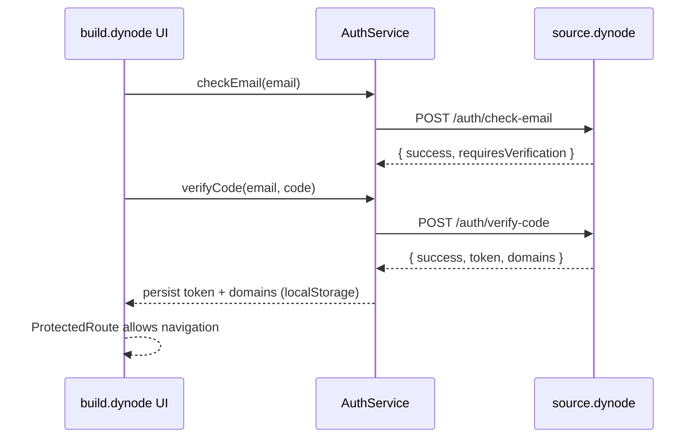
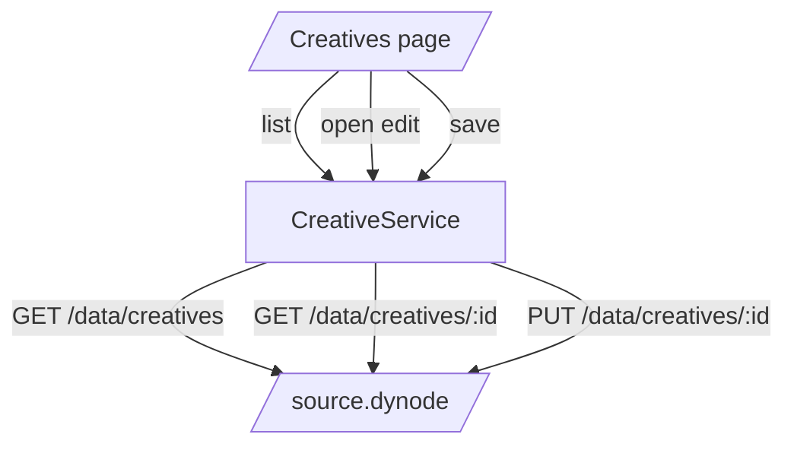
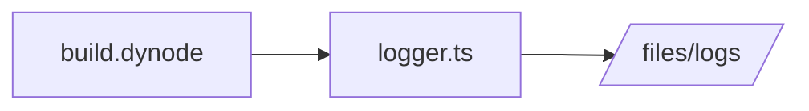

# build.dynode — Documentation & Flowcharts

A React + Vite builder UI for dynamic creatives. It authenticates via source.dynode, lists creatives, edits them, and uploads assets. This doc mirrors the structure used in source.dynode and render.dynode.

> Generated on 2025-09-25. If files or routes change, update labels accordingly.

## High-level

```mermaid
flowchart LR
  APP[App.tsx]
  L_MAIN[MainLayout]
  R_ROOT[/]
  R_HELP[/help]
  R_HELP_COMP[/help/components]
  R_CREATIVES[/creatives]
  R_EDIT[/creatives/edit/:id]
  R_ASSETS[/assets/upload]
  R_TEMPLATES[/templates]
  R_COMMUNITY[/community]

  APP --> L_MAIN --> R_ROOT
  L_MAIN --> R_HELP
  L_MAIN --> R_HELP_COMP
  L_MAIN --> R_CREATIVES
  L_MAIN --> R_TEMPLATES
  L_MAIN --> R_COMMUNITY
  R_EDIT -. full layout .-> APP
  L_MAIN --> R_ASSETS
```

## Authentication flow



## Data flow: creatives list and edit



## Logging pipeline



## Bundling/build

- Vite dev server on port 4000 (proxy /api -> http://localhost:3333)
- Manual chunks configured in vite.config.ts for vendor and app modules
- Dockerfile builds and serves via Nginx (HTTPS on 4444 using provided PFX)

## Key files

- src/App.tsx: Router + lazy pages; wraps in ProtectedRoute under AuthProvider
- src/contexts/AuthContext.tsx: token/domains persistence and guards
- src/services/auth.ts: /auth/check-email + /auth/verify-code
- src/services/creative.ts: list/get/put/delete creatives; flatten elements helpers
- src/services/logger.ts: posts logs to source.dynode /files/logs
- src/layouts/MainLayout.tsx and src/layouts/FullLayout.tsx
- src/pages/\*\*: Home, Creatives (list/edit), Help, Assets upload, Templates, Community
- vite.config.ts: dev server, proxy, manualChunks

## Setup

### Environment

Set Vite env vars (Docker build args or .env):

```ini
VITE_SOURCE_API_URL=http://localhost:3000
VITE_RENDER_BASE_URL=http://localhost:5000
VITE_BUILDER_BASE_URL=http://localhost:4000
```

### Run locally

```powershell
npm ci
npm run dev
```

### Build & Preview

```powershell
npm run build
npm run preview
```

### Docker

```powershell
# build (requires cert/build.dynode.pfx and PFX_PASSWORD)
docker build --build-arg PFX_PASSWORD=YourVeryStrongAndSecretPasswordHere -t build-dynode:latest .
# run
docker run -p 4444:4444 build-dynode:latest
```
