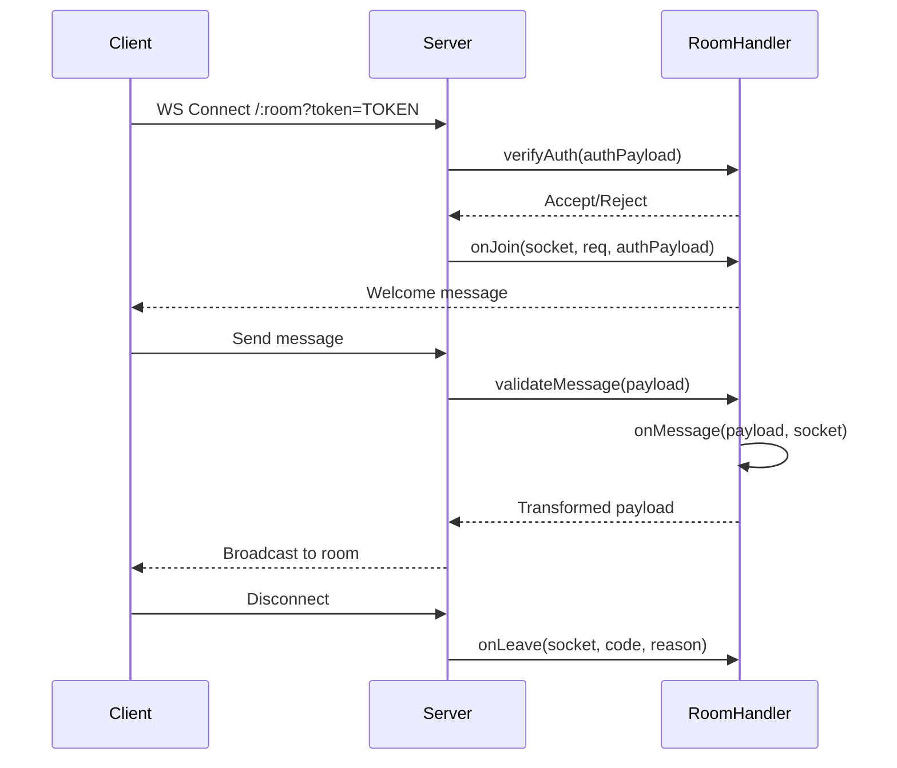

# Echo.dynode - WebSocket Broadcast Server

> **Real-time WebSocket broadcasting with room-based routing and HTTP injection**

## Overview

Echo.dynode is a specialized WebSocket server that provides real-time broadcasting capabilities for the Dynode ecosystem. It uses a room-based architecture with modular handlers, HMAC-signed authentication, and supports both WebSocket and HTTP POST injection for server-to-client communication.

## Technology Stack

- **Runtime**: Node.js 18+
- **WebSocket**: ws 8.18
- **Language**: Pure JavaScript (ES modules)
- **Authentication**: HMAC-SHA256 signed tokens
- **Logging**: Winston 3.11
- **Cache**: ioredis 5.3 (optional)
- **Rate Limiting**: express-rate-limit 7.1
- **API Docs**: Swagger UI with authentication

## Key Features

### Room-Based Architecture

- **BaseRoomHandler Pattern**: Extensible base class with lifecycle hooks
- **Auto-Discovery**: Automatic room registration from `src/rooms/` directory
- **Custom Rooms**: Easy creation of new rooms by extending BaseRoomHandler
- **Built-in Rooms**: `radio` (content broadcasting), `chat` (messaging)

### Authentication

- **HMAC-SHA256 Tokens**: Cryptographically signed tokens with room scope
- **Per-Room Auth**: Custom authentication logic via `verifyAuth()` hook
- **Token Expiration**: Configurable expiration times
- **Signature Verification**: Automatic validation on connection

### Broadcasting

- **WebSocket Messaging**: Real-time bidirectional communication
- **HTTP POST Injection**: Server-to-client push via HTTP endpoints
- **Broadcast Delay**: Configurable delay for synchronized delivery
- **Control Channels**: Management clients receive metadata without content

### Connection Management

- **Heartbeat Keepalive**: 30-second ping/pong (configurable)
- **Connection Tracking**: Per-room client tracking
- **Lifecycle Hooks**: `onJoin`, `onLeave`, `onMessage`, `onHttpPost`
- **Graceful Shutdown**: Clean connection termination

## Architecture

### Project Structure

```
echo.dynode/
├── src/
│   ├── server.js           # Main server entry point
│   ├── rooms/
│   │   ├── BaseRoomHandler.js    # Abstract base class
│   │   ├── index.js              # Auto-discovery logic
│   │   ├── routes.js             # Generic HTTP routes
│   │   ├── radio/
│   │   │   └── RadioRoomHandler.js
│   │   └── chat/
│   │       └── ChatRoomHandler.js
│   └── auth/
│       └── token.js        # Token generation
├── .docs/
│   └── api/                # API documentation
└── package.json
```

### BaseRoomHandler Lifecycle



### BaseRoomHandler Methods

**Authentication:**

- `verifyAuth(authPayload, req, clientAddress)` - Custom auth logic

**Lifecycle:**

- `onJoin(socket, req, clientAddress, authPayload)` - Client connected
- `onLeave(socket, clientAddress, code, reason)` - Client disconnected
- `onControlJoin(socket, req, clientAddress)` - Control client connected
- `onControlLeave(socket, clientAddress, code, reason)` - Control client disconnected

**Message Handling:**

- `onMessage(payload, socket, clientAddress)` - Process WebSocket message
- `onHttpPost(payload)` - Process HTTP POST injection
- `validateMessage(payload, socket)` - Validate WebSocket payload
- `validateHttpPost(payload)` - Validate HTTP POST payload

**Utilities:**

- `getWelcomeMessage(socket)` - Custom welcome for new clients
- `getRoomStats(clients)` - Room statistics for health endpoint
- `onHeartbeat()` - Periodic maintenance hook
- `getRoutes()` - Custom HTTP routes for room
- `getControlPayload(context)` - Control channel payload generation
- `getBroadcastDelay(context)` - Dynamic broadcast delay calculation

## API Endpoints

### Authentication

**POST /auth/token**

- Generate WebSocket token
- Body: `{clientId: string, room: string, expiresIn: number}`
- Returns: `{token: string, expiresAt: number}`

### Health

**GET /health**

- Server health and statistics
- Returns room counts, client counts, uptime

### Broadcasting

**POST /:room/postcontent**

- Inject content into room via HTTP
- Headers: `Authorization: Bearer TOKEN`
- Body: Room-specific payload
- Returns: `{success: boolean, clientCount: number}`

### Documentation

**GET /docs**

- Swagger UI interface
- Requires authentication (username/password)

## WebSocket Protocol

### Connection

```javascript
const ws = new WebSocket("ws://localhost:7777/radio?token=TOKEN");
```

### Message Format

**Client → Server:**

```json
{
  "type": "message",
  "content": {...},
  "metadata": {...}
}
```

**Server → Client:**

```json
{
  "type": "radio-content",
  "content": {...},
  "timestamp": 1707235200,
  "from": "server"
}
```

### Heartbeat

- Server sends `ping` every 30 seconds
- Client must respond with `pong`
- Connection terminated after 60 seconds without pong

## Setup & Installation

### Prerequisites

- Node.js 18 or higher
- npm or yarn

### Installation

```bash
# Install dependencies
npm install

# Copy environment file
cp .env.dev .env
```

### Environment Variables

```env
# Server
NODE_ENV=development
PORT=7777
HOST=0.0.0.0

# Authentication
HMAC_SECRET=your_secret_key_here

# WebSocket
HEARTBEAT_INTERVAL=30000
CLIENT_TIMEOUT=60000
MAX_PAYLOAD_BYTES=10485760

# Documentation
DOCS_USERNAME=admin
DOCS_PASSWORD=password
```

### Running Locally

```bash
# Development mode (with nodemon)
npm run dev

# Production mode
npm start
```

### Access Points

- **WebSocket**: ws://localhost:7777/:room?token=TOKEN
- **HTTP API**: http://localhost:7777
- **Swagger Docs**: http://localhost:7777/docs

## Creating Custom Rooms

### 1. Create Room Handler

Create `src/rooms/myroom/MyRoomHandler.js`:

```javascript
import { BaseRoomHandler } from "../BaseRoomHandler.js";

export class MyRoomHandler extends BaseRoomHandler {
  constructor(roomName) {
    super(roomName);
    this.requiresAuth = true;
    this.broadcastDelay = 0;
  }

  async verifyAuth(authPayload, req, clientAddress) {
    // Custom authentication logic
    if (!authPayload || !authPayload.clientId) {
      return {
        reject: true,
        code: 4001,
        reason: "Missing clientId",
      };
    }
    return true;
  }

  async onJoin(socket, req, clientAddress, authPayload) {
    console.log(`Client ${authPayload.clientId} joined`);
  }

  async onMessage(payload, socket, clientAddress) {
    // Transform or validate message
    return {
      ...payload,
      processed: true,
      timestamp: Date.now(),
    };
  }

  getWelcomeMessage(socket) {
    return {
      type: "welcome",
      message: "Welcome to MyRoom!",
      timestamp: Date.now(),
    };
  }
}
```

### 2. Auto-Registration

The room is automatically discovered and registered on server start.

### 3. Connect Clients

```javascript
const token = await generateToken("client-001", "myroom", 3600);
const ws = new WebSocket(`ws://localhost:7777/myroom?token=${token}`);
```

## Docker Deployment

### Build Image

```bash
docker build -t echo-dynode:latest .
```

### Run Container

```bash
docker run -d \
  -p 7777:80 \
  -e NODE_ENV=production \
  -e HMAC_SECRET=your_secret \
  echo-dynode:latest
```

### Docker Compose

```yaml
services:
  echo:
    build: .
    ports:
      - "7777:80"
    environment:
      - NODE_ENV=production
      - HMAC_SECRET=${HMAC_SECRET}
```

## Security Considerations

### Token Security

- HMAC-SHA256 signatures prevent tampering
- Tokens are room-scoped
- Configurable expiration times
- Signature verification on every connection

### Rate Limiting

- Configurable per endpoint
- Protection against abuse
- Automatic client disconnection on violations

### Production Checklist

- [ ] Set strong HMAC_SECRET
- [ ] Configure rate limiting
- [ ] Enable HTTPS proxy (nginx/Caddy)
- [ ] Set up monitoring and alerts
- [ ] Configure log rotation
- [ ] Change default docs credentials

## Troubleshooting

### Connection Refused

- Verify server is running: `curl http://localhost:7777/health`
- Check firewall settings
- Ensure correct port in connection string

### Authentication Failed

- Verify token is valid and not expired
- Check HMAC_SECRET matches between token generation and server
- Ensure room name in token matches connection URL

### Heartbeat Timeout

- Check network stability
- Verify client is responding to ping messages
- Adjust HEARTBEAT_INTERVAL and CLIENT_TIMEOUT

## Contributing

See the main [Dynode README](file:///E:/Development/Web/NODE/Dynode/.docs/README.md) for contribution guidelines.

## License

[Specify license]

---

**Version**: 3.0  
**Last Updated**: February 6, 2026
