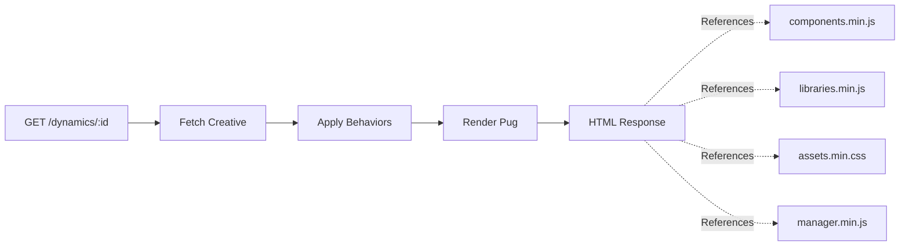

# Render.dynode - Creative Rendering Engine

> **On-demand creative rendering with bundling, minification, and asset proxying**

## Overview

Render.dynode is a specialized Express service that fetches creative definitions from source.dynode, applies behaviors, bundles and minifies JavaScript/CSS resources, and renders HTML pages for digital signage players and web browsers. It acts as the delivery layer for the Dynode ecosystem.

## Technology Stack

- **Runtime**: Node.js 18+
- **Framework**: Express 5.1
- **Language**: TypeScript 5.8
- **Minification**: Terser 5.43 (JS), CleanCSS 5.3 (CSS)
- **HTTP Client**: Axios 1.10
- **Template Engine**: Pug 2.0
- **Caching**: lru-cache 11.2
- **Logging**: Winston 3.17

## Key Features

### Creative Rendering

- **Dynamic HTML Generation**: Pug template rendering
- **Behavior Application**: Pre-render creative transformations
- **Asset Injection**: Automatic script and style tag generation
- **Responsive Output**: Mobile and desktop optimized

### On-Demand Bundling

- **Component Bundling**: Concatenate and minify component JavaScript
- **Library Bundling**: Package animation libraries
- **CSS Bundling**: Generate `@font-face` rules and custom styles
- **Manager Script**: Creative-specific configuration injection

### Asset Proxying

- **Transparent Proxying**: Fetch assets from source.dynode
- **MIME Type Detection**: Automatic content-type headers
- **Image Support**: jpg, png, svg, gif, bmp, webp
- **Video Support**: mov, mp4, avi, webm, mkv
- **Font Support**: ttf, otf, woff, woff2, eot

### Performance Optimization

- **LRU Caching**: In-memory cache for bundled resources
- **Minification**: JavaScript (Terser) and CSS (CleanCSS)
- **Compression**: Gzip/Brotli support
- **CDN-Ready**: Cacheable responses with proper headers

## Architecture

### Project Structure

```
render.dynode/
├── app.ts                      # Application entry point
├── config.ts                   # Environment configuration
├── routes/
│   ├── index.ts                # Root routes
│   ├── cache.ts                # Cache management
│   └── dynamics/
│       └── default.ts          # Creative rendering
├── services/
│   ├── bundler.ts              # Bundling logic
│   ├── behaviours.ts           # Behavior application
│   ├── caching.ts              # LRU cache
│   └── logger.ts               # Winston logger
├── views/
│   ├── pages/
│   │   └── dynamics/
│   │       └── content.pug     # Creative template
│   ├── scripts/
│   │   ├── components/         # Component files
│   │   ├── libraries/          # Animation libraries
│   │   └── manager.js          # Manager template
│   └── styles/
│       └── assets.css          # Asset CSS template
└── package.json
```

### Rendering Pipeline



### Bundler Service

**Bundle Types:**

1. **Components** (`components.min.js`)
   - Read component files from `views/scripts/components/`
   - Concatenate in dependency order
   - Minify with Terser

2. **Libraries** (`libraries.min.js`)
   - Read animation libraries
   - Concatenate
   - Minify with Terser

3. **Assets** (`assets.min.css`)
   - Generate `@font-face` rules
   - Combine with custom styles
   - Minify with CleanCSS

4. **Manager** (`manager.min.js`)
   - Inject creative-specific config
   - Minify with Terser

**Bundler Interface:**

```typescript
interface BundleRequest {
  creativeId: string;
  name: "components" | "libraries" | "assets" | "manager";
  items: string[];
  mode: boolean; // true = minified
  extension: "js" | "css";
}

interface BundleResponse {
  payload: string;
  contentType: string;
}
```

### Behavior System

**Behavior Application:**

```typescript
function applyBehavioursToCreative(creative: any): any {
  // Transform creative data before rendering
  // Examples:
  // - Resolve data bindings
  // - Apply conditional logic
  // - Transform element properties
  // - Inject runtime configuration
  return transformedCreative;
}
```

## API Endpoints

### Creative Rendering

**GET /dynamics/:id**

- Render creative HTML page
- Fetches creative from source.dynode
- Applies behaviors
- Renders Pug template
- Returns: HTML document

**GET /dynamics/:id/components.min.js**

- Bundle component JavaScript
- Query param: `debug=dev` for unminified
- Returns: Minified JavaScript

**GET /dynamics/:id/libraries.min.js**

- Bundle animation libraries
- Returns: Minified JavaScript

**GET /dynamics/:id/assets.min.css**

- Bundle asset CSS (fonts, custom styles)
- Returns: Minified CSS

**GET /dynamics/:id/manager.min.js**

- Bundle manager script with creative config
- Returns: Minified JavaScript

**GET /dynamics/:id/:filename.:ext**

- Proxy asset from source.dynode
- Supports: images, videos, fonts
- Returns: File with correct MIME type

### Cache Management

**GET /cache/stats**

- LRU cache statistics
- Returns: `{size, maxSize, hitRate}`

**POST /cache/clear**

- Clear LRU cache
- Returns: `{success: true}`

## Setup & Installation

### Prerequisites

- Node.js 18 or higher
- Access to source.dynode API
- npm or yarn

### Installation

```bash
# Install dependencies
npm install

# Copy environment file
cp .env.dev .env

# Configure source API
# Edit .env and set SOURCE_API_URL
```

### Environment Variables

```env
# Application
NODE_ENV=development
APP_ENV=development
PORT=5000

# Source API
SOURCE_API_URL=http://localhost:3333

# HTTPS (production)
HTTPS_ENABLED=false
PFX_PASSWORD=
```

### Running Locally

```bash
# Development mode (with hot reload)
npm run dev

# Production build
npm run build
npm start
```

### Access Points

- **Rendering**: http://localhost:5000
- **Creative**: http://localhost:5000/dynamics/:creativeId

## Development

### Adding a Behavior

```typescript
// services/behaviours.ts
export function applyBehavioursToCreative(creative: any): any {
  // Add custom transformation
  if (creative.type === "dynamic") {
    creative.elements = creative.elements.map((el) => ({
      ...el,
      customProperty: calculateValue(el),
    }));
  }

  return creative;
}
```

### Adding a Component

1. Create component file in `views/scripts/components/`:

```javascript
// views/scripts/components/MyComponent.js
class MyComponent {
  constructor(config) {
    this.config = config;
  }

  render() {
    // Rendering logic
  }
}
```

2. Component is automatically discovered and bundled

### Customizing Templates

Edit Pug templates in `views/pages/dynamics/`:

```pug
//- content.pug
doctype html
html
  head
    title= content.name
    link(rel="stylesheet" href=`${baseURL}/dynamics/${content._id}/assets.min.css`)
  body
    #app
    script(src=`${baseURL}/dynamics/${content._id}/components.min.js`)
    script(src=`${baseURL}/dynamics/${content._id}/libraries.min.js`)
    script(src=`${baseURL}/dynamics/${content._id}/manager.min.js`)
```

## Docker Deployment

### Build Image

```bash
docker build -t render-dynode:latest .
```

### Run Container

```bash
docker run -d \
  -p 5555:443 \
  -e APP_ENV=docker \
  -e SOURCE_API_URL=http://source:443 \
  render-dynode:latest
```

### Docker Compose

```yaml
services:
  render:
    build: .
    ports:
      - "5555:443"
    environment:
      - APP_ENV=docker
      - SOURCE_API_URL=http://source:443
    depends_on:
      - source
```

## Performance Optimization

### Caching Strategy

**LRU Cache:**

- Stores bundled resources in memory
- Configurable max size
- Automatic eviction of least-used items

**Cache Headers:**

```typescript
res.setHeader("Cache-Control", "public, max-age=3600");
res.setHeader("ETag", generateETag(content));
```

### Minification

**JavaScript (Terser):**

```typescript
const minified = await minify(code, {
  compress: true,
  mangle: true,
});
```

**CSS (CleanCSS):**

```typescript
const minified = new CleanCSS().minify(css).styles;
```

### Bundle Size Reduction

- Remove unused components
- Tree-shake libraries
- Optimize images before upload
- Use modern font formats (woff2)

## Security Considerations

### Asset Proxying

- Validate asset paths
- Prevent directory traversal
- Limit file sizes
- Sanitize filenames

### API Security

- Verify source.dynode responses
- Handle malformed creative data
- Timeout long-running requests
- Rate limit rendering endpoints

### Production Checklist

- [ ] Enable HTTPS
- [ ] Configure production source API URL
- [ ] Set up CDN for static assets
- [ ] Enable response compression
- [ ] Configure cache headers
- [ ] Set up monitoring and alerts

## Troubleshooting

### Creative Not Rendering

- Verify creative exists in source.dynode
- Check source API URL configuration
- Review creative JSON structure
- Check browser console for errors

### Bundle Empty or Incomplete

- Verify component files exist in `views/scripts/components/`
- Check creative resources array
- Review bundler logs
- Verify file permissions

### Asset 404 Errors

- Check asset exists in source.dynode
- Verify asset path in creative JSON
- Check source.dynode `/files/assets` endpoint
- Review proxy configuration

### Performance Issues

- Check LRU cache hit rate
- Monitor bundle sizes
- Review minification settings
- Consider CDN for assets

## Contributing

See the main [Dynode README](file:///E:/Development/Web/NODE/Dynode/.docs/README.md) for contribution guidelines.

## License

[Specify license]

---

**Version**: 3.0  
**Last Updated**: February 6, 2026
