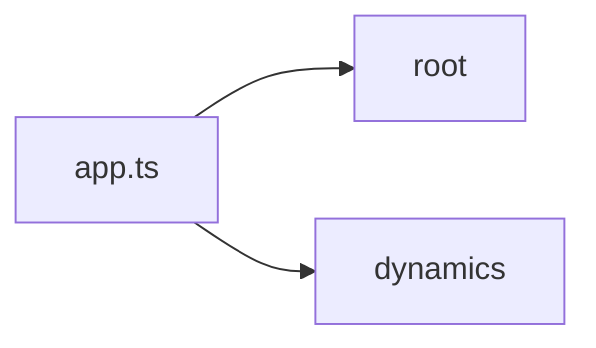
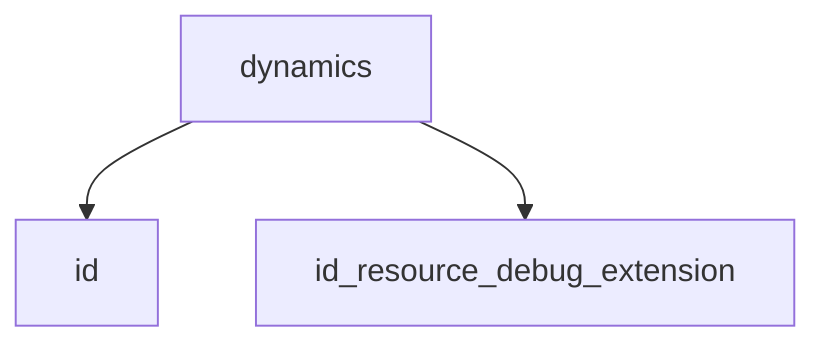
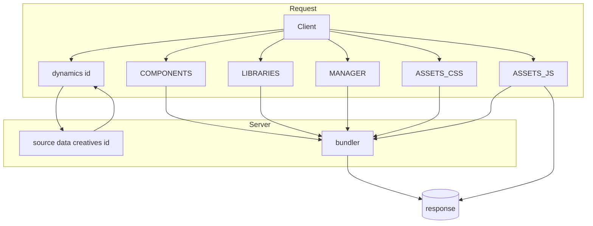
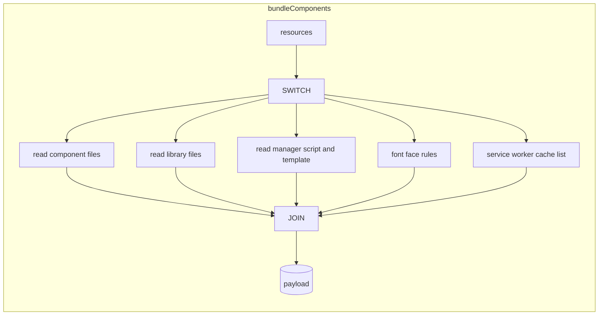
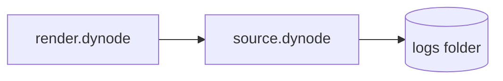

# render.dynode — Documentation & Flowcharts

This service renders dynamic creatives by fetching content from source.dynode and bundling client assets on-the-fly.

> Generated on 2025-09-25. If routes or files move, update labels accordingly.

## High-level



## Routes overview



## Request/asset flow



## Bundler logic



## Logging pipeline



## Setup and run

### Prerequisites

- Node.js (18+ recommended)
- A running source.dynode (for /data and /files endpoints)

### Environment (.env)

```ini
NODE_ENV=development
PORT_ENV=5000
# Point to your source API for creatives and assets
SOURCE_API_URL=http://localhost:3000
# Optional: service workers logic in bundler
SERVICE_WORKERS=disabled
```

### Run locally

```powershell
npm ci
npm run dev
```

### Build and start

```powershell
npm run build
npm start
```

## Key files

- app.ts: Express app, index + /dynamics router, Pug views, logging
- routes/index.ts: mounts /dynamics and renders home
- routes/dynamics/default.ts: HTML render for :id and dynamic asset endpoints
- services/bundler.ts: concatenation/minification and template insertion
- services/logger.ts: posts logs to source.dynode /files/logs
- services/caching.ts: placeholder for future cache (kept for API completeness)
- views/pages/dynamics/content.pug: entry HTML for a dynamic creative
