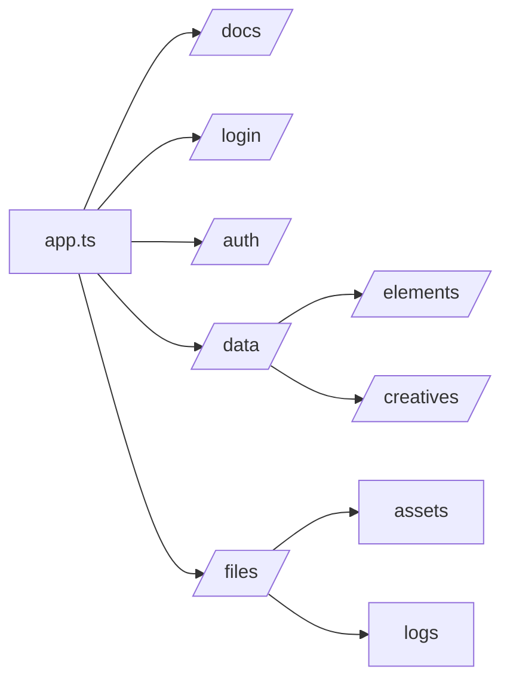
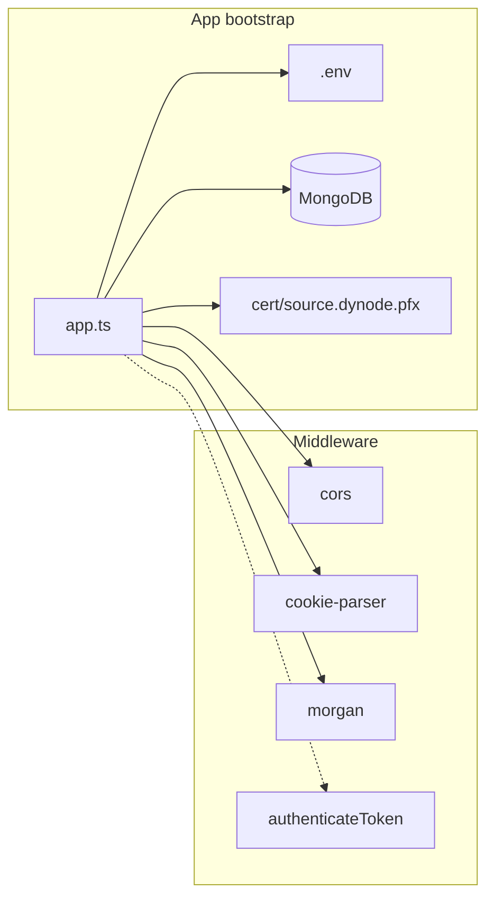
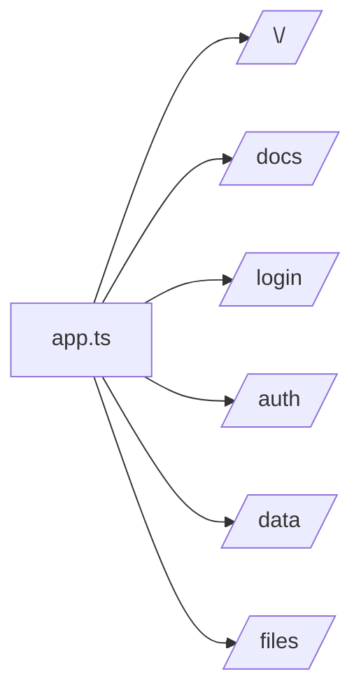
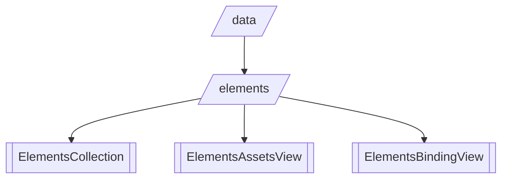
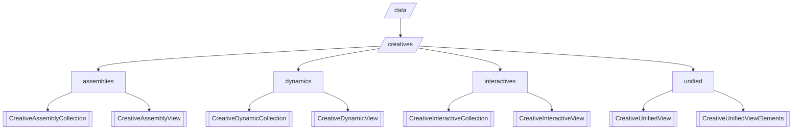
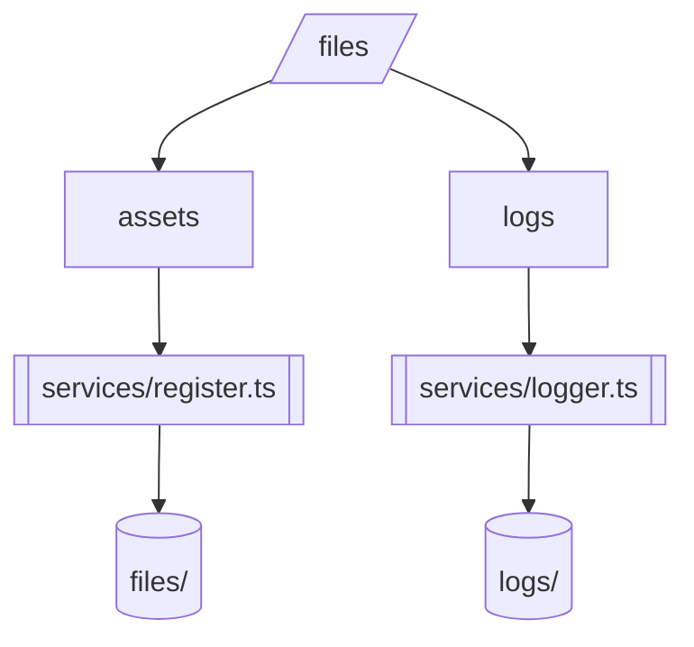
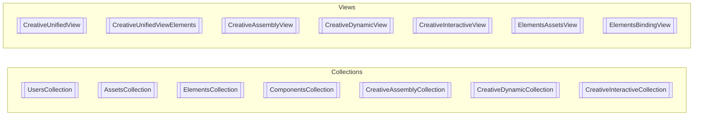
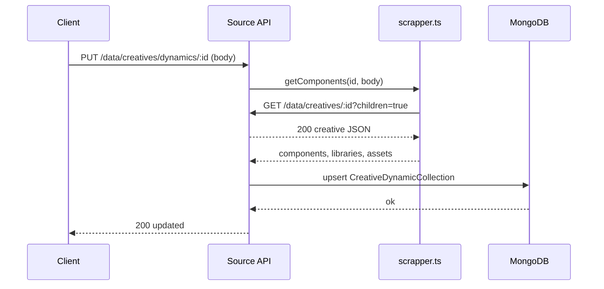

# Source (DYNODE) — Architecture & Flowchart

This document maps how the source.dynode service is wired: app bootstrap, middleware, routes, services, and models. Start with the flowchart to see how each file contributes to the application.

> Generated on 2025-09-25. If you move files, update the labels below accordingly.

## High-level architecture (flowchart)



### Reading the flowchart

- app.ts loads config, connects to MongoDB, sets middleware, mounts routers, and starts HTTP/HTTPS.
- Middleware are standard Express middlewares; JWT auth is defined but currently disabled for /data and /files in app.ts.
- Routes dispatch to services (logger, register/upload, scrapper) and to Mongoose models (collections for raw docs, views for joined/denormalized data).
- services/register saves files under `source.dynode/files/*` and returns metadata used by `AssetsCollection`.
- services/scrapper fetches the creative JSON from this API (`/data/creatives/:id?children=true`) and extracts components/libraries/assets metadata to store alongside creatives.

## Request lifecycles (concise)

- GET /docs

  - routes/swagger.ts serves Swagger UI (OpenAPI from `openapi.json`).

- POST /login

  - routes/login.ts → UsersCollection: verifies password with bcrypt, returns JWT if valid.

- POST /auth/check-email → POST /auth/verify-code

  - routes/auth.ts: issues a 6-digit code (logs it for dev), validates code, then signs a JWT; also GET /auth/me to decode JWT and return current user.

- GET /data/elements?mode=assets|binding

  - routes/data/elements/default.ts → ElementsCollection or ElementsAssetsView/ElementsBindingView based on mode.

- GET /data/creatives

  - routes/data/creatives/default.ts → CreativeUnifiedView (flat) or CreativeUnifiedViewElements (children=true).

- GET/PUT /data/creatives/{assemblies|dynamics|interactives}

  - routers under routes/data/creatives/\* use Collection (flat) or View (children=true) models.
  - PUT routes call services/scrapper.getComponents() to derive resources, then upsert into the Collection.

- POST /files/assets
  - routes/files/assets/default.ts uses multer storage in services/register.ts to save files, then creates an `AssetsCollection` document, logging via `services/logger.ts`.

## File-by-file contribution map (key files)

- app.ts: Application entrypoint; config, DB, middleware, routes, error handling, server start.
- middleware/auth.ts: JWT verification middleware (can be mounted per-route).
- services/
  - logger.ts: Winston logger with console + daily rotate file transports.
  - register.ts: Multer storage (dest by kind) + helper to infer asset info.
  - scrapper.ts: Parses creative JSON to extract components/libraries/assets grouping.
- routes/
  - index.ts: Renders Pug index.
  - swagger.ts: Swagger UI for OpenAPI.
  - login.ts: Username/password auth issuing JWT.
  - auth.ts: Email+code verification flow, issues JWT, user profile via /me.
  - data/default.ts: Mounts elements, creatives, components, users routers.
  - data/elements/default.ts: Lists elements via collection or specific materialized views.
  - data/components/default.ts: Lists/gets components collection.
  - data/creatives/default.ts: Lists unified creatives (flat or with children); get by id via elements view.
  - data/creatives/\*/default.ts: Assemblies/Dynamics/Interactives CRUD using corresponding collection or view; PUT updates resources via scrapper.
  - data/users/default.ts: Create user, reset password, edit user.
  - files/default.ts: Mounts assets and logs routers.
  - files/assets/default.ts: Uploads assets to disk and records `AssetsCollection` doc.
  - files/logs/default.ts: Accepts client logs and forwards to winston.
- models/
  - shared/\*: Reusable sub-schemas and base creative schemas (collection + view variants).
  - collections/\*: Mongoose models pointing to core MongoDB collections.
  - views/\*: Mongoose models pointing to materialized “view” collections.
- views/\*.pug: Server-side templates for index/error layout.

## Readable diagrams (open in VS Code Mermaid Preview)

- documentation/diagrams/app.mmd — App bootstrap + middleware
- documentation/diagrams/routes-top.mmd — Top-level routes
- documentation/diagrams/data-elements.mmd — Elements data path
- documentation/diagrams/data-creatives.mmd — Creatives data path
- documentation/diagrams/files.mmd — Files (assets, logs) and services
- documentation/diagrams/models.mmd — Collections and Views
- documentation/diagrams/seq-put-dynamic.mmd — Sequence: update a dynamic creative

## Per-area diagrams (embedded)

### App bootstrap + middleware



### Top-level routes



### Data: elements



### Data: creatives



### Files: assets + logs



### Data models: collections vs views



### Sequence: PUT /data/creatives/dynamics/:id



## Advanced diagram (local preview)

For a richer diagram with icons and special shapes, open `docs/flowchart-advanced.mmd` in VS Code and use the Mermaid Preview extension.

## Setup and run

### Prerequisites

- Node.js (18+ recommended)
- MongoDB running locally or a connection string

### Environment variables (.env)

Create `source.dynode/.env`:

```ini
NODE_ENV=development
PORT_ENV=3000
MONGO_URI=mongodb://localhost:27017/dyna_content

# CORS allowlist (origins that can call this API)
SOURCE_API_URL=http://localhost:3000
RENDER_BASE_URL=http://localhost:4000
BUILDER_BASE_URL=http://localhost:5000

# Folders are resolved relative to dist runtime
SOURCE_LOGS_FOLDER=../logs
SOURCE_ASSETS_FOLDER=../files

# Optional logging levels
LOG_LEVEL=debug
CONSOLE_LOG_LEVEL=debug
FILE_LOG_LEVEL=info
```

### Run locally (watch)

```powershell
npm ci
npm run dev
```

### Build and start (prod-like)

```powershell
npm run build
npm start
```

### API docs

- After the server starts, open: http://localhost:3000/docs
